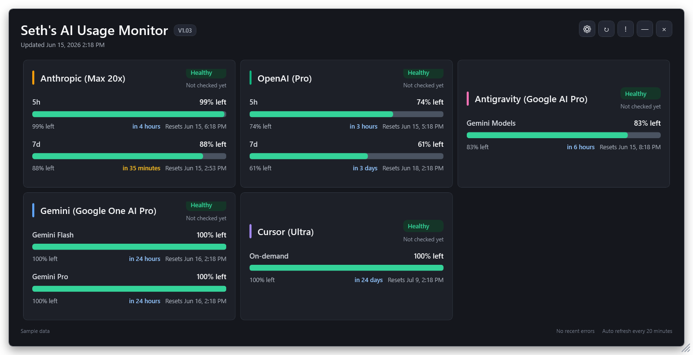
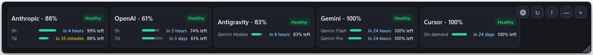
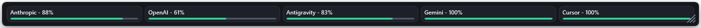
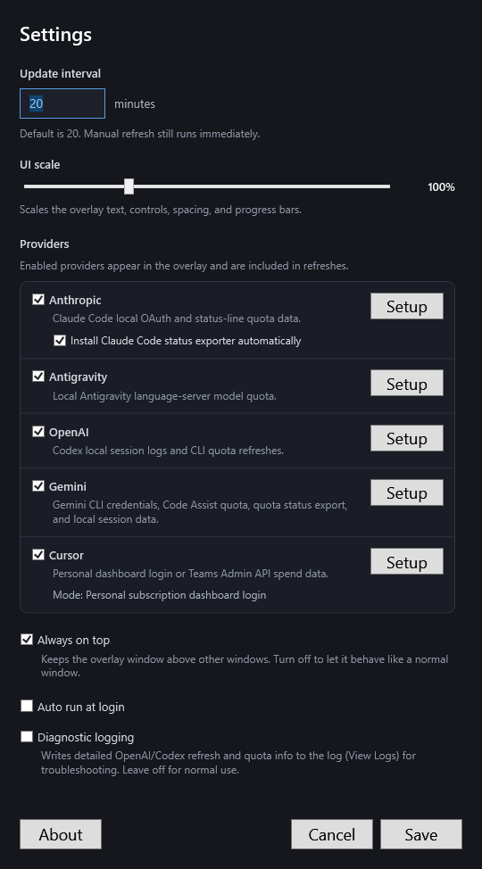

# Seth's AI Usage Monitor

The overlay changes content density as you resize it instead of simply shrinking the same layout.

Settings let you pick the refresh interval, UI scale, which providers appear, whether the overlay stays always-on-top, and more:

# Download #

Current version: V1.03, latest updated June 14, 2026.

**[Download for Windows - Code signed by me, Seth A. Robinson](https://rtsoft.com/files/SethsAIUsageMonitor-win-x64.zip)**

# Info #

Windows tray app for checking remaining AI subscription usage across Anthropic, OpenAI/Codex, Antigravity, Gemini, and Cursor.

Warning: refreshing stale Anthropic/OpenAI data may run a tiny CLI probe, which can consume a small amount of your plan usage.

This is app was stupid easy to make, so you have a need for it, you undoubtely can just have AI make your own.  Even so, I like to put things like this on Github though to stay organized and have reliable source backups.

- Always-on-top overlay with percentage remaining, reset times, plan names, and per-provider last checked status.
- Supports Anthropic, OpenAI/Codex, Antigravity, Gemini, and Cursor local usage checks.
- Tray controls for show/hide, refresh now, settings, logs, and exit.
- Layout adjusts as you drag the size to fit more or less info, UI scale slider in its Settings
- Provider errors go to copyable logs and use backoff to avoid hammering services.
- Build from VS Code with `dotnet build`; run with `dotnet run --project AIUsageMonitor.csproj`.
- Build a standalone Windows x64 zip with `package-release.bat`.

Requires Windows and the .NET 10 SDK for development.

## AI Disclosure

This project was developed with significant assistance from AI tools.  I mean, you can still blame me (Seth) for bugs, but I just wanted to mention it.

## Credits

Created by Seth A. Robinson - [Homepage](https://www.rtsoft.com/) | [Blog](https://www.codedojo.com/) | [Twitter](https://twitter.com/rtsoft) | [Bluesky](https://bsky.app/profile/rtsoft.com) | [Mastodon](https://mastodon.gamedev.place/@rtsoft)
